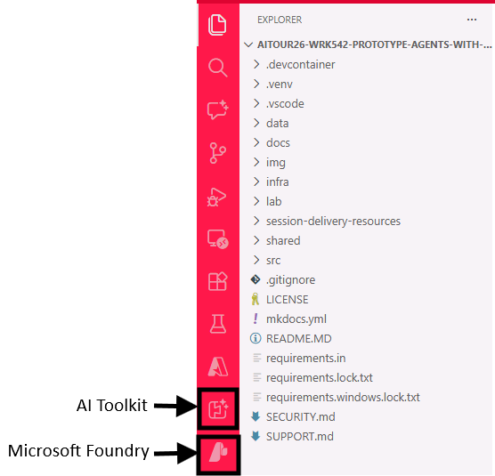
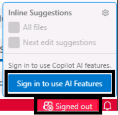
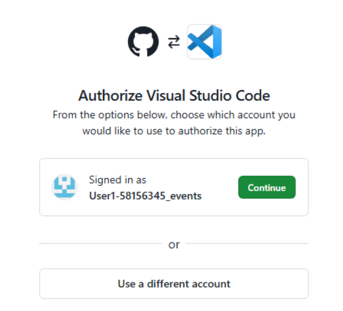

# Get started

> [!TIP]
> What is the **AI Toolkit(AITK)**? [The AI Toolkit (AITK)](https://code.visualstudio.com/docs/intelligentapps/overview) is an extension for Visual Studio Code that provides a unified interface to access and interact with various AI models and services. It allows users to easily explore, compare, and utilize different AI models from multiple providers, both proprietary and open source, hosted on several platforms, such as Github, Microsoft Foundry or even locally. With AITK, developers can streamline their Generative AI development workflow by integrating model selection, prompt engineering, and agent prototyping and testing directly within their code editor.

## Sign in to Windows

As a first step, login into the lab Virtual Machine using the credentials you can find in the **Resources tab** under the Skillable VM name.


> [!TIP]
> First time using **Skillable?** The "T" icon (e.g., +++Admin+++) indicates values that are automatically input for you at the current cursor location in VM, with one click. This reduces your effort and minimizes input errors.
> Also, you can always click on the images to enlarge them, if needed.

## Login to GitHub

For this workshop, you'll be using a GitHub Enterprise (GHE) account to access GitHub-hosted models in the AI Toolkit Model Catalog and GitHub Copilot features in Visual Studio Code.

Follow the instructions below to sign-in with a given GitHub Enterprise (GHE) account.

1. Open the edge browser from the taskbar. You'll get a browser tab with the [GHE sign-in page](https://github.com/enterprises/skillable-events) already opened for you.

2. Click on **Continue** and sign-in with the following credentials:
   -  Username: +++@lab.CloudPortalCredential(User1).Username+++
   -  TAP: +++@lab.CloudPortalCredential(User1).TAP+++

Once you get the **Overview** page of the *Skillable Events* GitHub org, that means you are successfully logged in. You can hide the browser tab and move forward with opening the workshop environment in Visual Studio Code.

## Open the Workshop Environment in Visual Studio Code

Follow these steps to open the workshop environment in Visual Studio Code.
Open the terminal by clicking on the terminal icon in the taskbar at the bottom of the screen.


Copy and paste the following command block to the terminal and press **Enter**. The following command block updates the workshop repository, activates the Python virtual environment, and opens the project in VS Code.

```powershell
; cd $HOME\aitour26-WRK542-prototype-agents-with-the-ai-toolkit-and-model-context-protocol\ `
; git pull `
; Remove-Item -Recurse -Force .git `
; .\.venv\Scripts\activate `
; code .
```

> [!NOTE]
> You'll get a warning about pasting multiple lines in the terminal. Click on **Paste anyway** to proceed.

## Authenticate to Azure

In your Visual Studio Code instance, you should be able to see two extensions already installed: 
- The **AI Toolkit**: this is the extension we will be using to interact with various AI models and services in this lab.
- The **Microsoft Foundry** extension: it's installed as a bundle of the AI Toolkit and provides access to Microsoft Foundry hosted models. 
If they are correctly installed, you should see their icons in the left sidebar of VS Code, as per screenshot below.



> [!TIP]
> If you don't see the icons, click on the ellipsis (...) at the bottom of the sidebar to see the full list of installed extensions. 

Now click on the Microsoft Foundry extension icon, and then click on **Set Default Project** -> **Sign in to Azure**.


You'll be prompted with a popup to confirm with the Azure login. Click **Allow**.


Next, you'll be redirected to a window to complete the login process. Enter the following credentials:
-  Email: +++@lab.CloudPortalCredential(User1).Username+++
-  TAP: +++@lab.CloudPortalCredential(User1).TAP+++

> [!NOTE]
> You'll be asked to confirm if you want to allow the automatic sign-in to all desktop apps and websites on the device. Click **Yes, all apps** to proceed. Then click **Done** to complete the login process and return to VS Code.

Back in your VS Code instance, you'll be asked to select the Foundry project to use. Select the only available option, which is the project pre-deployed for this workshop.


## Enable GitHub Copilot AI features

In this workshop, you'll also be using GitHub Copilot AI features in Visual Studio Code to assist you in your development tasks. To enable GitHub Copilot, you need to sign-in with the same GitHub Enterprise (GHE) account used previously in the Edge browser. Follow the steps below to sign-in to GitHub Copilot:

1. Click on the **Copilot** icon in the right bottom corner of the VS Code window, accompanied by the text "Signed out".
1. Next, click on **Sign in to use AI features** -> **Continue with GitHub**.



1. A new browser tab will open, prompting you to authorize VS Code. Click on **Continue** to sign-in with the same GHE account you used before.  In the next window, click on **Authorize Visual Studio Code**.



1. A prompt will appear, notifying you that the website is trying to open Visual Studio Code. Click on **Open Visual Studio Code** to proceed and come back to your VS Code instance.

<!-- ## Got issues when logging in with GitHub?

> [!NOTE]
> If you are properly logged in with the GHE account as per previous step, please ignore this section and move to the next one.

If you encounter issues when logging in with the given GHE account, you can always use your own, by following the steps below:

1. Navigate to the [GitHub repo](https://aka.ms/msignite25-lab512) hosting the lab code and resources. 

    > [!TIP]
    > Click the Star button in the top right corner, this will help you easily find it later.

2. To launch a codespace, you need a **GitHub account**. 

    > [!NOTE]
    > If you already have a GitHub account, you can move to step 3 directly.

    To create one, click on the **Sign up** button and follow the instructions below:
    - In the new window, enter a personal email address, create a password, and choose a username.
    - Select your Country/Region and agree to the terms of service.
    - Click on the **Create account** button and wait for the verification email to arrive in your inbox.

    

    - Copy the verification code from the email and paste it into the verification field on the GitHub website. Then click on **Continue**.
    - Once the account is created, you'll be redirected back to the GitHub repo page and you'll see a green banner at the top, like the one in the screenshot below.

    

> [!WARNING]
> If your personal GitHub account is a free-tier one, you will have some limitations in the range of GitHub-hosted models you can access in the AI Toolkit Model Catalog. For example, you won't be able to use the GPT-5 family of models. You can still proceed with the lab using available models (recommended: OpenAI gpt-4.1).

3. Click on **Sign in** and enter your GitHub credentials to log in. If you just created your account, use the username and password you set during the sign-up process. -->


## Ready to start

That covers the necessary setup to work with the AI Toolkit in VScode and Microsoft Foundry hosted models. We will now move forward to begin exploring the Model Catalog and interacting with the models.
Click **Next** to proceed to the following section of the lab.