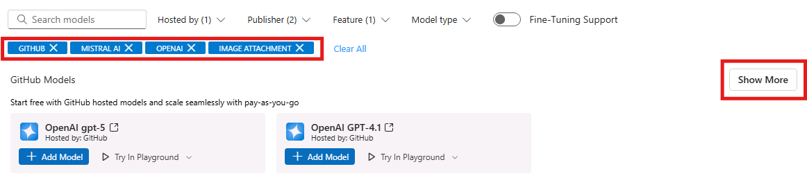
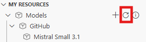
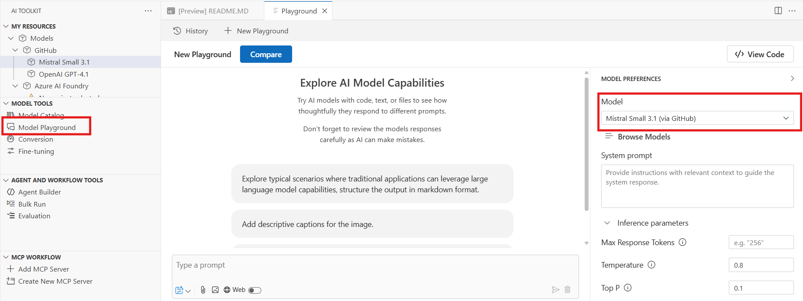
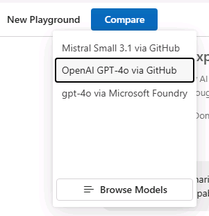
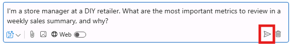
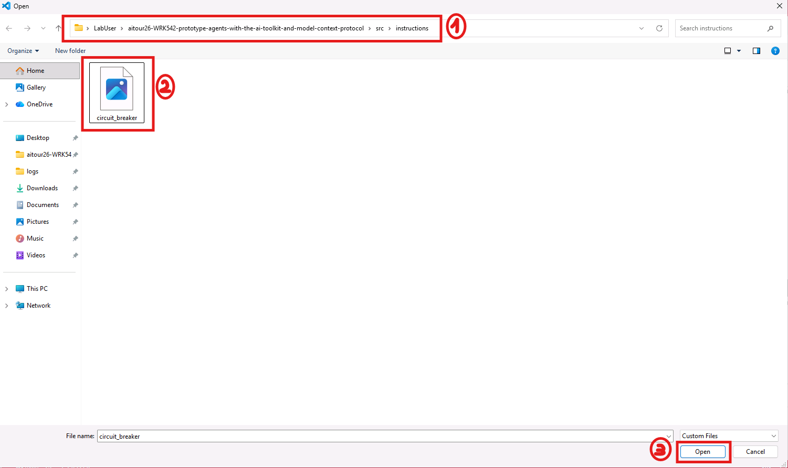
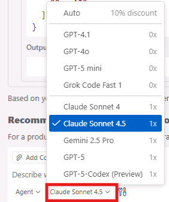
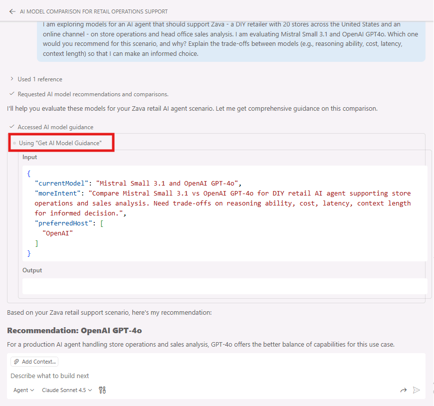
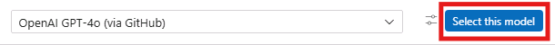
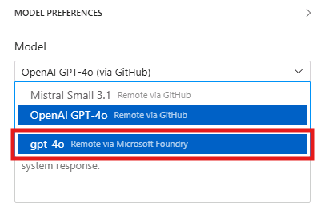

# Model Selection: Exploring the AI Toolkit Model Catalog

In this section, you will explore the AI Toolkit Model Catalog to discover, filter, and compare models for your multimodal agent project. The Model Catalog provides access to models from various providers including GitHub, Microsoft Foundry, OpenAI, and others.

## Step 1: Apply Filters to Narrow Your Selection

1. Locate the **AI Toolkit** extension icon in the left sidebar
2. Click on the AI Toolkit icon to open the extension panel
3. Click on **Model Catalog** to browse available models


On the top of the page you'll find the most popular models; scroll down to see the full list of available models.

Since the list is quite consistent, you can use the filtering options to narrow down the selection based on your requirements.


### Filter by Hosting Provider

1. Click on the **Hosted by** filter dropdown. You have several options, such as GitHub, Microsoft Foundry, OpenAI and you can even leverage models hosted on your local infrastructure, through Ollama or ONNX.

2. Select **GitHub** to view free-to-use models that are excellent for prototyping.

> [!NOTE]
> GitHub models are perfect for getting started because they're free to use, but they are token-rate limited. You can experiment without cost concerns, but for production deployments consider using a pay-as-you-go offering through your GitHub Account or Microsoft Foundry.

### Filter by Publisher

1. Click on the **Publisher** filter dropdown to filter by the model publisher, such as Microsoft, Meta, Cohere, etc. Note that you can find both open-source and proprietary models.
2. Select **OpenAI** and **Mistral AI** to view models from these two leading providers.

### Filter by Model Feature

1. Click on the **Feature** filter dropdown to filter by model capabilities, such as image/audio or video processing, tool calling, etc.
2. Select **Image Attachment** to find multimodal models that support visual input processing and enables multimodal interactions combining text and images.

## Step 2: Add Models to Your Collection

After applying filters, you'll see a refined list of models. 

For this exercise:

1. Locate the **OpenAI GPT-4o** and **Mistral Small 3.1** models in the filtered results.
   - **OpenAI GPT-4o** is a full-featured multimodal model with comprehensive capabilities
   - **Mistral Small 3.1** is an optimized smaller model with faster response times and lower costs.
   
> [!TIP]
> If you cannot see one of the two models, click on **Show more** to see the complete list of filtered models.
>
> 
> Alternatively, you can also search for the model names directly using the search bar at the top left of the Model Catalog panel.

2. Click **Add model** on the *Mistral Small 3.1* model tile to add it to your collection. Repeat the same for **OpenAI GPT-4o**.


> [!NOTE]
> Once they are added, you'll see a green label with the text **Added**.

## Step 3: Open the Playground for Testing

1. Click on **Try in Playground** within the model tile. The Playground allows you to test and compare models interactively.


2. You'll be prompted to login to your GitHub account to access the free-tier models. Click **Allow** and complete the authentication process, by using the same GitHub credentials you used in the previous lab section.

> [!TIP]
> Now that you are logged in, you should be able to see the models you added into your collection in the 'My resources' tab, under 'GitHub', in the AI Toolkit extension panel.
>
> 
>
> If you don't see them, click on the refresh icon to update the view.

3. In the **Model** field, you'll see the name of the model you just selected, for example **Mistral Small 3.1 (via GitHub)**. 



> [!WARNING]
> You might experience some delay in model loading, especially if it's your first time accessing the Playground. Please be patient while the model initializes.

4. Next, click the **Compare** button to enable side-by-side comparison
5. From the dropdown, select your second model (OpenAI GPT-4o if Mistral Small 3.1 is already selected)
6. You now have two models ready for comparison testing



## Step 4: Test Text Generation and Multimodal Capabilities

> [!TIP]
> The side-by-side comparison allows you to see exactly how different models handle the same input, making it easier to choose the best fit for your specific use case.

Let's start interacting with the models with a simple prompt:

1. Enter this prompt in the text field (where you see the placeholder "Type a prompt"):

```
I’m a store manager at a DIY retailer. What are the most important metrics to review in a weekly sales summary, and why?
```
2. Click the paper airplane icon to execute the prompt on both models simultaneously



> [!WARNING]
> Since you are testing a free-tier GitHub-hosted model experience, you might encounter some latency in model response times, especially for more complex prompts.

Now let's test their reasoning capabilities, with the following prompt:
```
We have 3 stores (A, B, C). We only have 40 circuit breakers total across all stores and replenishment arrives in 10 days.

Here’s a simple snapshot of sales trend and stock on hand:

| Store | Sales trend (WoW) | Avg weekly units sold | Current stock (units) |
|------:|-------------------:|----------------------:|----------------------:|
| A     | +30%              | 18                    | 8                     |
| B     | 0%                | 10                    | 22                    |
| C     | -15%              | 7                     | 10                    |

How should we allocate stock today to minimize stockouts and lost sales? Explain your reasoning step by step, and list the 3 most important additional data points you would ask for.
```

Next, test the models' image processing capabilities:

1. Enter this prompt in the text field:
```
Describe what's in this image and what kind of electrical component it appears to be.
```

2. Click the image attachment icon to add a picture as input


3. You'll be prompted with a browsing window to select the image file attachment to upload. Navigate to the following location:
```
C:\Users\LabUser\aitour26-WRK542-prototype-agents-with-the-ai-toolkit-and-model-context-protocol\src\instructions
```
Then select the file named **circuit_breaker.png** and click **Open**.


4. Send the multimodal prompt on both models simultaneously.

## Step 5: Analyze and Compare Results

Review the outputs from both models, using several factors to guide your evaluation:

- **Response Quality**: Compare the depth and accuracy of descriptions, as well as the coherence with the input prompt.
- **Detail Level**: Which model provides more comprehensive analysis?
- **Processing Time**: Note any differences in response speed.
- **Output Formatting**: Evaluate clarity and organization of responses, as well as verbosity.
- **Token Usage**: Inspect the token usage for each model to understand cost implications. Note that token usage may vary not only based on the verbosity of the response but also on the tokenizer efficiency of each model.

> [!TIP]
> Number of output tokens is visible in the response footer, along with characters length. LLMs are non-deterministic, so you might see slight variations in token usage across multiple runs with the same input prompt.
>
> 

### Leverage GitHub Copilot for Comparative Analysis

To assist with the comparative analysis, you can leverage GitHub Copilot to generate a comparison summary.

To access GitHub Copilot Chat, select the **Toggle Chat** icon at the top of the Visual Studio Code window.


> [!NOTE]
> You'll be asked to log in at your first interaction with Copilot. Select **Sign-in** -> **Continue with GitHub**. Then click on **Continue** to proceed with the GitHub account you used to access the GitHub hosted models, when redirected to the GitHub sign-in page.

Ensure you have *Claude Sonnet 4.5* model selected. Otherwise, expand the dropdown menu to select it.


> [!WARNING]
> If you are not logged in, you won't be able to select the model. Send a simple message in the chat window to trigger the login process.

Try the following prompt in the Copilot chat window:

```
I am exploring models for an AI agent that should support Zava - a DIY retailer with 20 stores across the United States and an online channel - on store operations and head office sales analysis. I am evaluating Mistral Small 3.1 and OpenAI GPT-4o. Which one would you recommend for this scenario, and why? Explain the trade-offs between models (e.g., reasoning ability, cost, latency, context length) so that I can make an informed choice.
```

To answer this, Copilot calls the *Get AI Model Guidance* tool of the AI Toolkit, which provides model recommendations based on your use case. In the response, you should see an expandable section with the details of the tool call, followed by the comparative analysis.



> [!NOTE]
> If GitHub Copilot doesn't invoke the AI Toolkit tools when generating its response, you can enter `#aitk` in the chat window to explicitly select which tool(s) you'd like GitHub Copilot to use prior to submitting your prompt.

## Step 6: Import selected model from Microsoft Foundry

Once we are done with the comparison, we are going to select one of the two models for further prototyping in the next lab sections. For the sake of this exercise, let's go with **GPT-4o**. 

> [!TIP]
> To come back to the standard Playground (with a single pane and a single model),you can click on **Select this model** on the right side of the model name.
>
> 

Now, since in the next section we are going to augment the model with additional context data relative to Zava, our DIY retail company, we need to switch to a model hosted in Microsoft Foundry, which provides enterprise-grade security and compliance features.

Go back to **Model Playground** and expand the **Model** dropdown and select the gpt-4o instance hosted in Microsoft Foundry, that has been pre-deployed for this workshop, in the project you logged into in the [previous lab section](./01_Get_Started.md).



> [!NOTE]
> While GitHub models are excellent for prototyping, Microsoft Foundry hosted models provide the enterprise features needed for production deployments, including enterprise-grade security and compliance, Service Level Agreements (SLAs), enhanced performance and scalability, and integration with other Azure services.

## Key Takeaways

- The Model Catalog provides a comprehensive view of available AI models from multiple providers
- Filtering capabilities help you quickly identify models that match your specific requirements
- Model comparison in the Playground enables data-driven decision making
- Different hosting options offer varying benefits for different stages of development
- Multimodal capabilities can be tested effectively using the built-in comparison tools

This exploration process ensures you select the most appropriate model for your specific use case, balancing factors like performance, cost, features, and deployment requirements.
Click **Next** to proceed to the following section of the lab.
