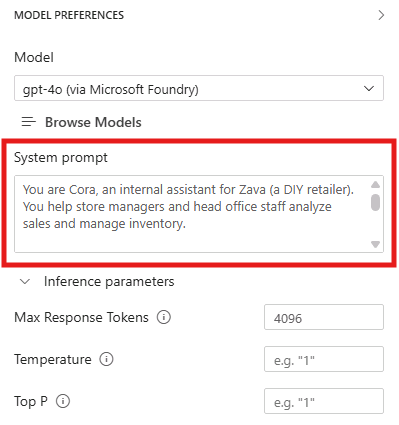
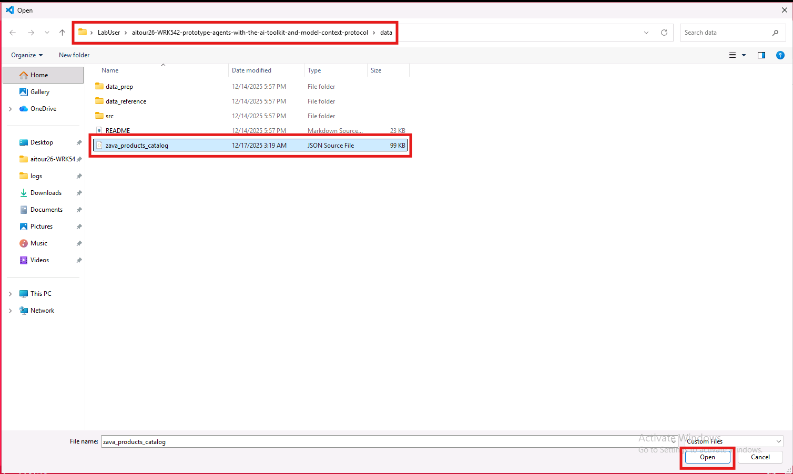

# Model Augmentation: Enhancing Context for Improved Performance

In this section, you will learn how to augment your selected model using prompt engineering and context data to improve its performance and relevance to your specific use case. This is a crucial step in tailoring AI models to meet the unique needs of your business scenario.

## Step 1: Crafting the System Message

The system message is a critical component of the prompt that sets the behavior and context for the AI model. It helps the model understand its role and the specific requirements of the task at hand. Here are some key considerations for crafting an effective system message:

1. **Be Clear and Concise**: Clearly articulate the purpose of the interaction and the desired outcome. Avoid ambiguity to ensure the model understands the task.

2. **Provide Context**: Include relevant background information or context that will help the model generate more accurate and context-aware responses.

3. **Set Expectations**: Specify any constraints or requirements for the response, such as format, length, or style.

4. **Break Down Complex Instructions**: If the task is complex, consider breaking it down into simpler, step-by-step instructions to guide the model effectively.

In the **System Prompt** field of the Playground, in the right pane, enter the following system message:

```
You are Cora, an internal assistant for Zava (a DIY retailer). You help store managers and head office staff analyze sales and manage inventory.

Your role is to:
- Ask clarifying questions to understand the reporting or inventory request.
- Provide concise, actionable summaries and recommendations.
- Be careful with operational actions: if asked to move inventory, you must ask for explicit confirmation first.
- Be brief in your responses.
Your personality is:
- Professional, precise, and helpful
- Curious and practical—never assume, always clarify

Stick to Zava store operations, sales analysis, and inventory topics. If asked something outside of that, politely say you can only assist with Zava-related operational requests.
```


Note that this message includes:
- A clear definition of the assistant's **role and responsibilities** (internal store operations + head office analysis)
- Clear guidance on **how to respond** (brief, actionable, and clarification-first)
- Safety **guardrails** for operational actions (ask for explicit confirmation before inventory moves)

## Step 2: Testing the System Message with Multimodal Input

Now that we configured the system prompt, let's test the system with a multimodal user prompt. In the playground chat, click the image attachment icon to upload an image in the conversation context. Then select the circuit breaker image available at the following path:

```    
C:\Users\LabUser\aitour26-WRK542-prototype-agents-with-the-ai-toolkit-and-model-context-protocol\src\instructions\circuit_breaker.png
```
Combine it with the following user prompt:

```
Here’s a photo from the store floor. What is this component, and what details should I capture (e.g., amperage, pole type) before searching our catalog and checking stock?
```

The model will analyze the image and provides an explanation along with some suggested details to capture, to search the catalog and check stock. Read through the response and see if it aligns with the expectations set in the system message.

Let's now test the model with a user query which is not relevant to Zava's business. Enter the following prompt:

```
What’s the weather like in San Francisco today? 
```

The model should politely inform the user that it can only assist with Zava-related inquiries, demonstrating its ability to follow the guidelines set in the system message.

## Step 3: Adding Grounding Data

In addition to the system message, providing context data can significantly enhance the model's ability to generate relevant and accurate responses. Context data can include information about your business, products, services, or any other relevant details that can help the model better understand the scenario.

For our use case, we are going to provide the model with some context about Zava's product catalog, so it can answer internal questions without making up product details.

To add grounding data, we will use the **file attachment** feature in the Playground. This allows us to upload documents that the model can reference when generating responses.

The document we are going to upload is a JSON file containing a subset of Zava's product catalog. If you want to have a look at its content, browse to the `/data/` folder and locate the file named `zava_product_catalog.json`. Open it in the code editor.

1. Click the file attachment icon in the prompt input area.

2. Select the file `zava_product_catalog.json` from the `/data/` directory.

> [!TIP]
> In the window that opens, you can find the data directory at the following path:
> ```
>C:\Users\LabUser\aitour26-WRK542-prototype-agents-with-the-ai-toolkit-and-model-context-protocol\data
> ```



3. Once the file is uploaded, it will appear as an attachment below the prompt input area.
4. Enter the following prompt in the text field:
```
From the attached Zava product catalog, suggest a circuit breaker option that would commonly be used for a 15-amp household circuit, and explain what you would verify before recommending it.
```

The model will analyze the uploaded product catalog and provide a grounded suggestion that matches the circuit breaker request.

What happens behind the scenes is that the attached data is automatically included in the prompt context, enabling the model to generate more informed and relevant responses.

Of course this approach has its limitations, as the model can only process a limited amount of text in the prompt context, and the larger is the attached context the higher is the response latency and cost. For larger datasets or more complex scenarios, you need to implement a more sophisticated retrieval mechanism to ensure the model prompt includes only the most relevant information for the current user query. We are going to explore this in more details in the next section of this workshop.

## Key Takeaways
- Crafting an effective system message is crucial for guiding the model's behavior and ensuring relevant responses.
- Providing context data through file attachments can significantly enhance the model's performance and relevance.
- Testing the model with multimodal input helps validate the effectiveness of the system message and context data.
- Grounding data should be relevant and concise to fit within the model's input limitations.        

Click **Next** to proceed to the following section of the lab.