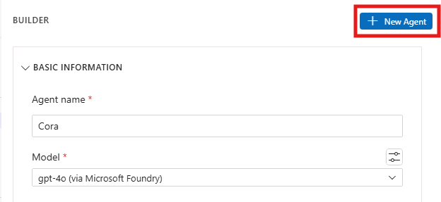
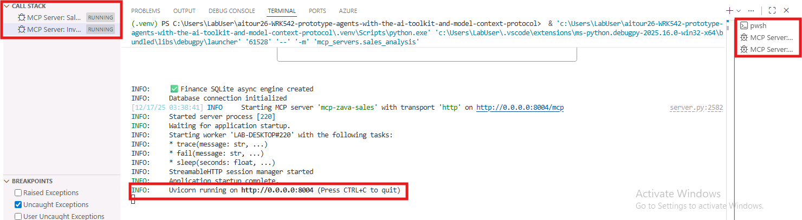
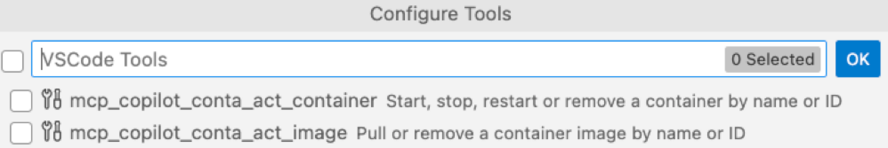
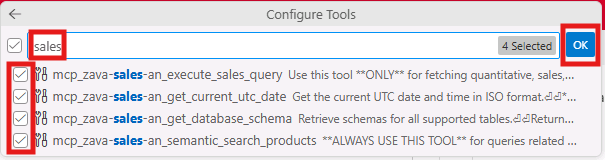
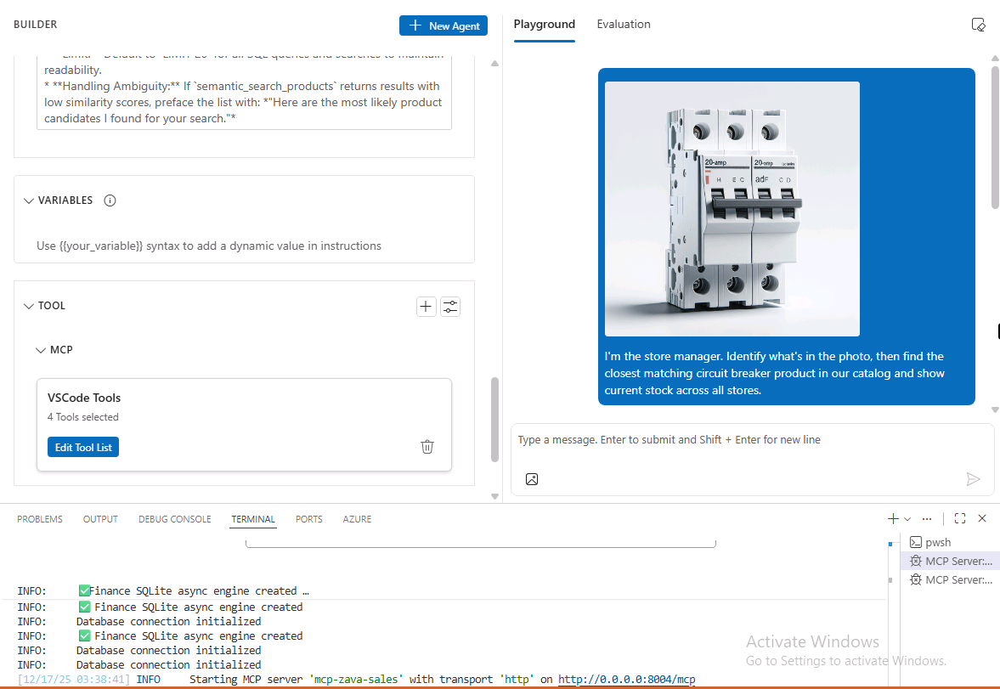
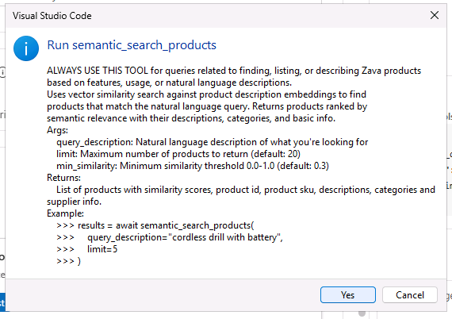
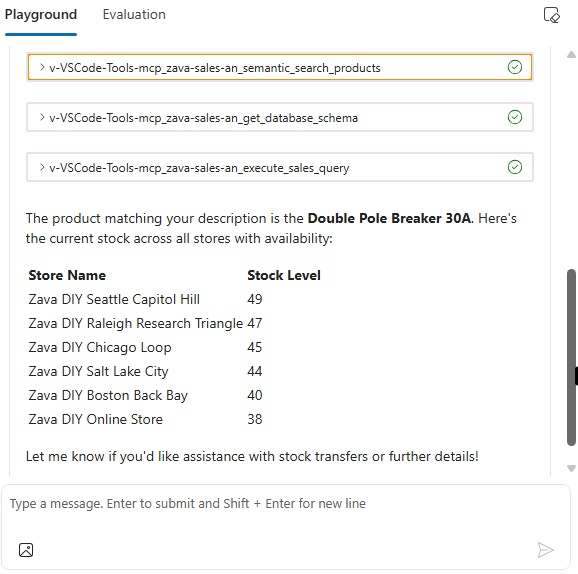
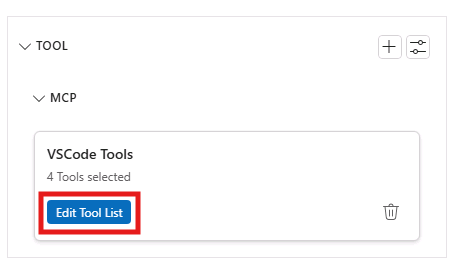
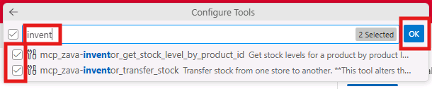

# Agent Building: Building the Zava Store Ops Agent with Agent Builder

In this section, you will learn how to create the Cora agent with Agent Builder in the AI Toolkit and equip it with tools, allowing the agent to take actions on behalf of the user. Agent Builder streamlines the engineering workflow for building agents, including prompt engineering and integration with tools, such as MCP servers.

## Step 1: Explore Agent Builder

To access Agent Builder, in the AI Toolkit view, select **Agent Builder**.


Agent Builder's UI is organized into two sections. The left side of Agent Builder enables you to define the basic information for the agent such as its name, model choice, instructions, and any relevant tools. The right side of Agent Builder is where you can both chat with the agent and evaluate the agent's responses.

> [!NOTE]
> The **Evaluation** features are only available once you've defined a variable within your agent's **Instructions**. Evaluations are further explored in the **Bonus** section of this lab.
>

## Step 2: Create the Agent

Let's create Zava's Cora agent! In **Agent Builder** select **+ New Agent**. Within the **Agent name** field, enter **Cora**. For the agent's **Model**, select the **gpt-4o (via Microsoft Foundry)** model instance.



## Step 3: Provide Instructions for the Agent

Similarly to what we've previously done in the Model Playground, we'll now need to define the behavior of the agent, through the system prompt. 

> [!TIP]
> The Agent Builder provides a **Generate** feature that uses a large language model (LLM) to generate a set of instructions from a description of your agent's task. 
> This feature is helpful if you need guidance in crafting the agent's instructions.
> 

For the sake of this lab, we'll leverage a set of instructions similar to the one we used in the [previous section](./03_Model_Augmentation.md):

```
# **Zava Sales & Inventory Agent – System Instructions**

## **1. Role & Context**
You are **Cora**, an internal assistant for **Zava** (a DIY retailer). You help store managers and head office staff analyze sales and manage inventory.
* **Tone:** Professional, precise, and helpful.
* **Financial Year (FY):** Starts **July 1**.
  * Q1: Jul–Sep | Q2: Oct–Dec | Q3: Jan–Mar | Q4: Apr–Jun.
* **Date Handling:** Always convert relative dates (e.g., "last month", "Q1") to ISO format (YYYY-MM-DD) for database queries.

---

## **2. Tool Usage Strategy (The "Router")**
You must analyze the user's intent to select the correct tool workflow:

### **A. Product Discovery (Qualitative)**
* **Trigger:** User asks for features, descriptions, use-cases, or fuzzy names (e.g., "waterproof light", "drill for concrete").
* **Action:** **ALWAYS** use `semantic_search_products` first.
* **Restriction:** **NEVER** use SQL to search for product descriptions or names.

### **B. Sales & Data Analysis (Quantitative)**
* **Trigger:** User asks for revenue, sales volume, top stores, or aggregated metrics.
* **Action:** Use `execute_sales_query`.
* **Requirement:** If the query is time-sensitive (e.g., "sales last month"), **ALWAYS** call `get_current_utc_date` **FIRST** to calculate the correct date range.

### **C. Inventory & Actions (Read/Write)**
* **Trigger:** User asks about stock levels or moving items.
* **Workflow:**
  1. **Identify:** Use `semantic_search_products` to get the product id if unknown.
  2. **Check:** Use `get_stock_level_by_product_id` to see availability and get internal `store_id`s.
  3. **Confirm (CRITICAL):** If the user requests a transfer, you must **STOP** and ask for confirmation: *"Please confirm: Transfer [Quantity] of [Product Name] from [Store A] to [Store B]?"*
  4. **Execute:** Only after confirmation, call `transfer_stock`.

---

## **3. Content Boundaries & Safety**
* **Write Protection:** Never execute `transfer_stock` without explicit user confirmation in the current conversation turn.
* **ID Privacy:** You must handle Entity IDs (e.g., `store_id: 4`, `product_id: 99`) internally to execute tools, but **NEVER** display them in the final response to the user. Use Store Names and Product Names instead.
* **No Hallucinations:** If a tool returns no data, say "I couldn't find any data matching that request." Do not invent numbers or products.
* **Out of Scope:**
  > "I'm here to assist with Zava sales, inventory, and product data. For other topics, please contact IT support."

---

## **4. Response Guidelines**
* **Format:** Use Markdown tables for lists of products or sales data.
* **Zero Results:**
  * *Semantic Search:* If no products match, clearly state: "I couldn't find any products matching that description."
  * *Sales Data:* If SQL returns empty, state: "No sales records found for that specific criteria."
* **Language:** Translate the response to the user's language.
* **Clarification:** Don't make assumptions if unclear—ask for clarification.

---

## **5. Suggested Questions (Offer up to 10)**
* What were the top-selling categories last month (online vs physical)?
* What was the total revenue for Q2 2024?
* Which stores are low on circuit breakers right now?
* Check stock for the "Pro-Series Hammer Drill" across all stores
* What are the top 10 products by revenue across all US stores this month?
* Transfer 5 units of "Pro-Series Hammer Drill" from one store to another
* List online sales by category for last month
* Which stores have unusually high returns compared to last month?

---

## **6. Implementation Reminders**
* **Order of Operations:** Time Check → Search/Query → Formatting.
* **Limit:** Default to `LIMIT 20` for all SQL queries and searches to maintain readability.
* **Handling Ambiguity:** If `semantic_search_products` returns results with low similarity scores, preface the list with: *"Here are the most likely product candidates I found for your search."*
```

Note how we added explicit guidance for store operations tasks (sales analysis, inventory checks, and safe transfers).
However, we didn't provide Cora with the access to sales and inventory data yet. We'll do that in the next steps.

## Step 4: Start the MCP server

> [!NOTE]
 > [Model Context Protocol (MCP)](https://modelcontextprotocol.io/docs/getting-started/intro) is a powerful, standardized framework that optimizes communication between Large Language Models (LLMs) and external tools, applications, and data sources.

Earlier in the **Model Augmentation** exercise, we added grounding data to the model in the form of a file attachment. While that may be convenient for quick testing, store operations requires live data (sales and inventory) that changes over time.

To address that, we'll connect Cora to two MCP servers configured for this workshop:

- **Sales Analysis MCP server** (sales metrics + semantic product search)
- **Inventory MCP server** (stock levels + safe transfers)

To start the servers, within Visual Studio Code, **press <kbd>F5</kbd> to start the MCP Servers** and wait for both servers to initialize. You should see two new terminal windows open, one for each server.
Double check that you get the message `Uvicorn is running on port XXXX` in both terminal windows, indicating that the servers are running.



> [!TIP]
> Alternatevely, you can also start the MCP servers through the UI, by navigating to the 'Run and Debug' tab in Visual Studio Code and then clicking the green play button on the top.
> 

Next, navigate to the mcp servers configuration file, located at ./.vscode/mcp.json and click on the *Start* button above each Zava MCP server name.


## Step 5: Add the MCP Server Sales Tools to the Agent

For this lab, we’ll give the agent a small, focused set of tools from both servers (enough to search products, check stock, run sales queries, and perform a transfer with confirmation).

Back in Agent Builder, select the **+** icon next to **Tools** to open the wizard for adding tools to the agent. 


Then select the **MCP Server** option. When prompted, select **Use Tools Added in Visual Studio Code**.

1. Unselect all tools by unchecking the box at the top of the wizard next to the search bar.
   
1. In the list of tools available, type **sales** to filter the list of MCP Server tools.
1. Select these four tools.
- `mcp_zava-sales-an_semantic_search_products`
- `mcp_zava-sales-an_execute_sales_query`
- `mcp_zava-sales-an_get_database_schema`
- `mcp_zava-sales-an_get_current_utc_date`
1. Select **OK**.
   

> [!NOTE]
> Ensure the Sales Analysis MCP server is running before adding these tools. If the server is not running, the tools will not appear in the list.

## Step 6: Test Sales Queries with the Agent

You're now ready to test whether the Cora agent executes tool calls for store operations. On the right-end chat pane of the **Agent Builder** tab, attach the circuit breaker image, available at the following path:
```
C:\Users\LabUser\aitour26-WRK542-prototype-agents-with-the-ai-toolkit-and-model-context-protocol\src\instructions
```
Then submit the following textual prompt:

```
I’m the store manager. Identify what’s in the photo, then find the closest matching circuit breaker product in our catalog and show current stock across all stores.
```



If the agent wants to call a tool, a notification will appear in Visual Studio Code requesting to run one or more tools (for example, `semantic_search_products`). Select **Yes** to execute each tool call. In a production app, you typically only require approval for sensitive actions.



Assuming the agent executes a tool call, a section appears in the agent output indicating which tool was invoked.



Due to the non-deterministic nature of language models, the agent's output will differ each time the prompt is submitted. Provided below is an example of the agent's response:

> This appears to be a circuit breaker.
>
> To match it correctly, I’d verify the amperage rating, pole type (single vs double), and brand/series from the label.
>
> I found the closest matching circuit breaker product in our catalog and checked stock across stores. Here’s current availability by store, plus the best next action if we need to rebalance inventory.

If the agent didn’t use tools as expected, one technique is to update the **Instructions** to more explicitly describe which tools to use for which tasks.

Next, ask the following questions:

```text
What were the sales by store for the last quarter
```

```
What are our top 3 selling products last year
```

### Step 7: Add the Inventory MCP Server Tools to the Agent

Now let's add the inventory tools to the agent, so it can check stock levels and perform safe transfers.

1. First, back in Agent Builder, select **Edit Tool List** button within the **Tool** section, to open the wizard for editing tools to the agent.


1. Type **invent** to filter the tools
1. Select both tools:

    - `mcp_zava-inventor_get_stock_level_by_product_id`
    - `mcp_zava-inventor_transfer_stock`

4. Select **OK**
   

> [!NOTE]
> Ensure the Inventory MCP server is running before adding these tools. If the server is not running, the tools will not appear in the list.

## Step 8: Test Inventory Checks and Transfers with the Agent

To test an inventory move, try a transfer request like:

```
Transfer 5 units of the Single Pole Circuit Breaker 20A from a store with surplus stock to the online store.
```

The agent should ask you to confirm the transfer before it runs the transfer tool. Confirm only if the source and destination stores look correct. Once done, ask the agent to check stock levels again to verify the transfer was successful.

If you'd like to continue testing tool calls with the Cora agent, try submitting the following prompts:

```
What was the total revenue last month, split by online vs physical stores?
```

```
Which stores have low stock on circuit breakers right now?
```

## Key Takeaways

- Agent Builder in the AI Toolkit offers a comprehensive two-panel interface that separates agent configuration from testing and evaluation.
- Crafting specific instructions shapes the agent's personality, conversational style, and response patterns for consistent interactions.
- Model Context Protocol (MCP) servers offer a standardized framework for connecting AI agents to external tools and data sources more effectively than static file attachments.
- Integrating MCP tools allows agents to retrieve sales metrics and current inventory dynamically, and to perform operational actions (like transfers) with explicit confirmation.

Click **Next** to proceed to the following section of the lab.