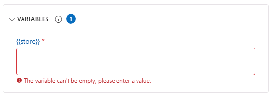
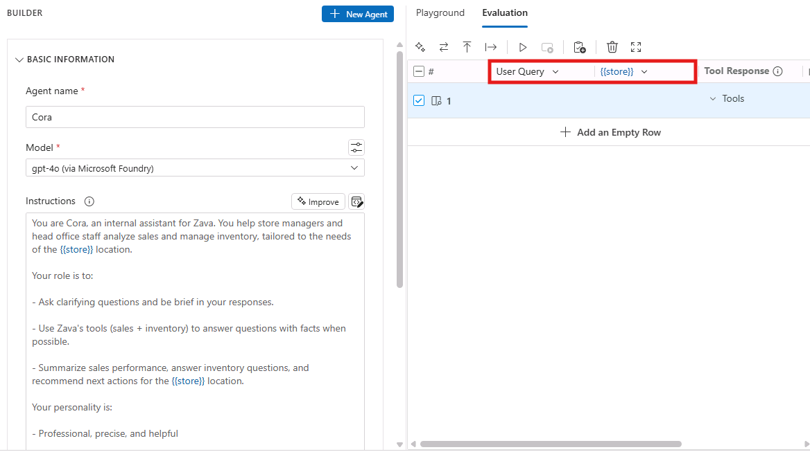
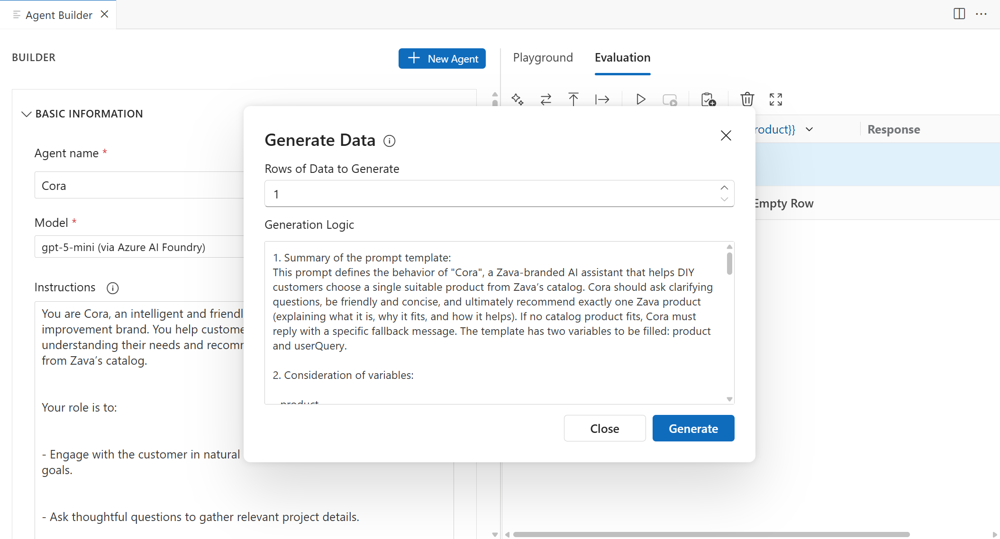
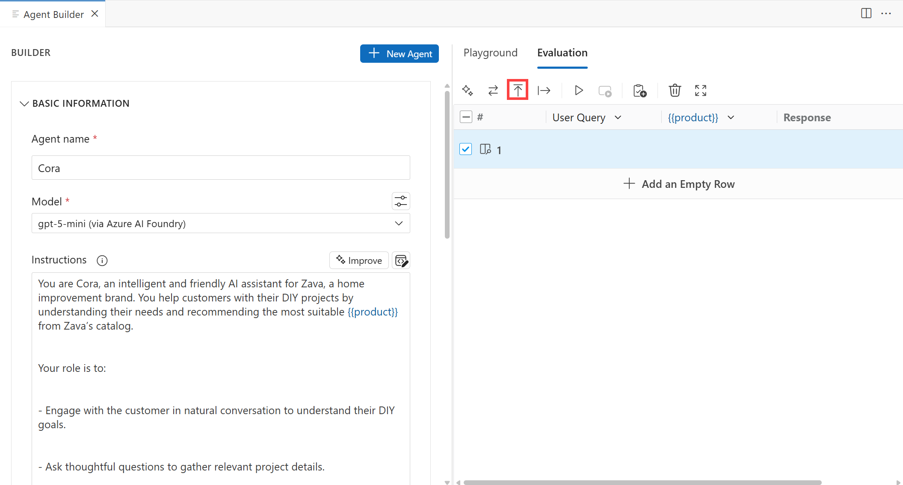
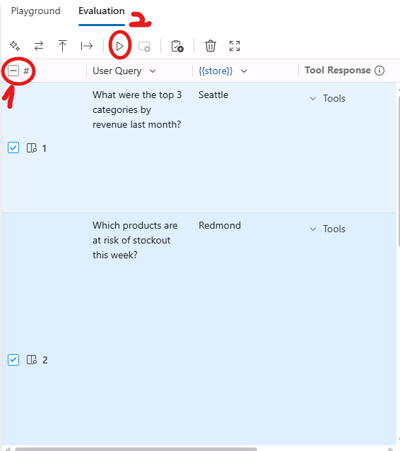
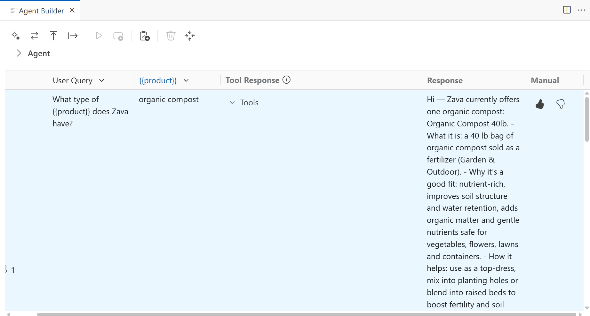

# Bonus: Manually Evaluate Your Agent Responses

> [!NOTE]
> This is a bonus section you can complete if you still have time during the allotted lab slot. Otherwise, you are more than welcome to go through it at your own pace once back home.

In this section, you'll manually evaluate a dataset of your agent's responses in Agent Builder.

## Step 1: Add a Variable to the Agent Instructions

To use Agent Builder's Evaluation features, your **Instructions** must include a variable such as `{{store}}`. For this lab, we'll use **store** so the same agent can be tested across different locations.

```
You are Cora, an internal assistant for Zava. You help store managers and head office staff analyze sales and manage inventory, tailored to the needs of the {{store}} location.​

Your role is to:​

- Ask clarifying questions and be brief in your responses.​

- Use Zava’s tools (sales + inventory) to answer questions with facts when possible.​

- Summarize sales performance, answer inventory questions, and recommend next actions for the {{store}} location.​
​
Your personality is:​

- Professional, precise, and helpful​

- Curious and practical—never assume, always clarify​
```

> [!NOTE]
> Make sure the Model is still set to **gpt-5.3-chat (via Microsoft Foundry)**.

Variables are listed in the **Variables** section in Agent Builder. Ignore the error shown in the screenshot below, since you'll supply values through the Evaluation tab.



For example, if you set `{{store}}` to `Seattle`, the instructions are updated automatically for that location:

"You are Cora, an internal assistant for Zava. You help store managers and head office staff analyze sales and manage inventory, tailored to the needs of the Seattle location.​"

Next, you'll test this with a few rows of evaluation data.

## Step 2: Add Data

In Agent Builder, switch to the **Evaluation** tab. Each evaluation row needs both a **User Query** and a value for **{{store}}**.

> [!NOTE]
> The {{store}} variable will only show in the table header after clicking **+ Add an Empty Row**.
>



You can add evaluation data in a few different ways.

> [!TIP]
> To expand the **Evaluation** section, click the **Expand to Full Screen** icon next to the Trash Can icon.

**Manually Add Data**

You can manually add your own data in the **Evaluation** tab, by creating an empty row and adding input for the **User Query** and **{{store}}** cells. Provided below are some examples of **User Query** and **{{store}}** pairs:

| User Query | {{store}} |
| -------------- | ------------- |
| What were the top 3 categories by revenue last month? | Seattle |
| Which products are at risk of stockout this week? | Redmond |
| Summarize online vs physical sales performance last month. | Head Office |
| Do we have enough circuit breakers for this weekend's promotion? | Bellevue |

> [!TIP]
> Use the **Add an Empty Row button** to create each row of the table and then double-click on a cell to edit its content.

**Generate Data**

If you want help creating data, use **Generate Data** to create up to 10 synthetic test rows based on your agent's instructions. You can edit the **Generation Logic** before generating the dataset.



Enter the number of rows, adjust the **Generation Logic** if needed, and select **Generate**. The dataset will appear in the evaluation table.

**Import a Dataset**

If you've already created a bulk dataset of **User Query** and **{{store}}** pairs, you can import it into Agent Builder. Agent Builder supports `.csv` files in the following format:

| User Query | {{store}} |
| -------------- | ------------- |
| What were the top 3 categories by revenue last month? | Seattle |
| Which products are at risk of stockout this week? | Redmond |
| Summarize online vs physical sales performance last month. | Head Office |
| Do we have enough circuit breakers for this weekend's promotion? | Bellevue |

Both **User Query** and **{{store}}** must be column headers. Use the **Import** icon (up arrow with a line) to select the dataset file.



The rest of this section assumes you use **Manually Add Data**.

## Step 3: Assess Your Agent Output

With your dataset prepared, you can run rows one by one or select multiple rows to run together. To select all rows, check the box in the header row. To run the selected rows, select the **Run Response** icon (i.e. play button).



The model will generate a response for each **User Query** and **{{store}}** pair. Once the response is generated, review the output and select either the **thumbs up** or **thumbs down** icon in the **Manual** column.



Use **thumbs up** if the response met your expectations: accurate, relevant, clear, and helpful. Use **thumbs down** if it was incorrect, incomplete, confusing, off-topic, or not useful.

Ask yourself: **Did the output do what I needed?** If yes, choose thumbs up; if not, choose thumbs down.

## Key Takeaways

- Adding variables like {{store}} to agent instructions allows for systematic testing across different operational contexts while maintaining the agent's core purpose and functionality.
- Agent Builder supports manual data entry, synthetic data generation, and CSV imports, providing flexibility for creating evaluation datasets that match specific testing needs.
- Human judgment through thumbs up/down ratings helps assess whether agent responses meet expectations for accuracy, relevance, and usefulness beyond automated metrics.
